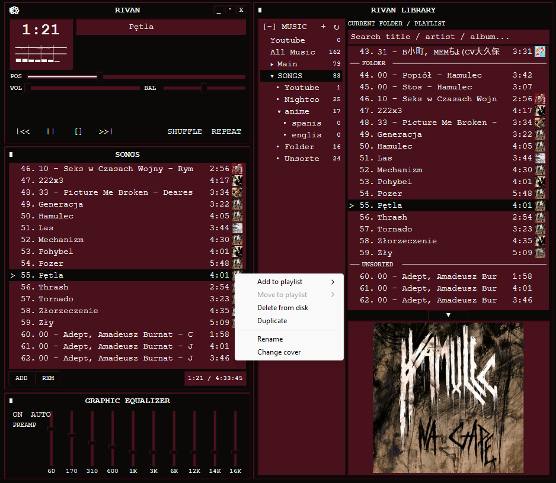

# Rivan 

Rivan is a local windows music player built with C++20, Win32, Direct2D, Media Foundation, and WASAPI<br>
More of a personal project, don't expect much. was made to be customizable and lightweight.

<div align="center">
  
</div>

## Features

- Customization with an easy to share .rivanskin file
- Folder-derived playlists, multiple library roots, recursive **All Music**, search
- File-preview panel with expandable video preview
- Optional YouTube/YouTube Music search and download through `yt-dlp`
- Optional Discord Rich Presence
- Optional lyrics
- Optional listen statistics
- Less than 1% cpu and ~50 mb of ram when minimized while playing a 2000 kb/s .FLAC file

## Planned
- more customization

## Supported media

Rivan recognizes these extensions case-insensitively: `mp3`, `wav`, `flac`, `mp4`, `m4a`, `opus`, `webm`, `ogg`, `aac`, and `m4v`.

## Build

Requirements:

- Windows 10 or 11
- Visual Studio with **Desktop development with C++** and MSVC v145 toolset
- Windows 10/11 SDK

Open `Rivan.slnx`, select `x64`, then build. From Developer Command Prompt:

```bat
msbuild Rivan.slnx /m /p:Configuration=Release /p:Platform=x64
```

Build output: `x64\Release\Rivan.exe`.

## Controls

| Input | Action |
|---|---|
| Space / K / media play key | Play or pause |
| Media stop key | Stop |
| Ctrl+Left / media previous | Previous track |
| Ctrl+Right / media next | Next track |
| Left / Right | Seek 5 seconds |
| Up / Down | Volume |
| S | Shuffle |
| R | Cycle repeat |
| Ctrl+S | Settings |
| M | Mini-player |

## Data and customization

Rivan stores small text files beneath `%LOCALAPPDATA%\Rivan`:

- `settings.ini` — library and appearance choices
- `session.ini` — window and playback restoration
- `skins\` — skin folders

Invalid or missing skins fall back to built-in theme. Skin model and archive implementation live under `src/skin`; plugin API declaration is `src/plugin/PluginApi.h`.

## Architecture

- `src/audio` — command-driven audio worker, Media Foundation Source Reader, WASAPI output
- `src/library`, `src/playlist` — filesystem catalog and navigation policy
- `src/youtube` — optional yt-dlp search/download (gated by settings)
- `src/discord` — optional Discord Rich Presence over named-pipe IPC
- `src/config`, `src/skin`, `src/core` — validated persistence and paths
- `src/ui`, `src/visualization` — Win32/Direct2D presentation and signal analysis
- `src/App.cpp` — service ownership and cross-subsystem coordination

Audio, scanning, and UI communicate through owned values and command queues. Decoded and visualization buffers are bounded; the app does not retain whole tracks in memory.

## Tests

`Rivan.Tests` is dependency-free console target covering supported-file scanning, nested folder playlists, shuffled queue history, repeat traversal, persistence, skin parsing, and FFT bin mapping.

```bat
msbuild Rivan.slnx /m /p:Configuration=Release /p:Platform=x64
x64\Debug\Rivan.Tests.exe
```
